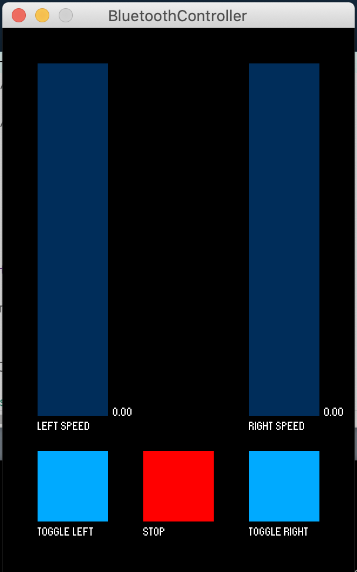

**Smart Systems Opdracht 2**

1. BluetoothSturing

   Via Bluetooth wordt er een geserialiseerd commando doorgestuurd bestaande uit 4 paramaters.

   LeftSpeed - snelheid van 0-255

   LeftDir - vooruit = 1 / achteruit = -1

   RightSpeed - snelheid van 0-255

   RightDir - vooruit = 1 / achteruit = -1

   Via deze parameters worden de motordrivers aangestuurd

2. BluetoothController

   De interface van de controller is snel geprogrammeerd in Processing. 2 sliders bepalen de snelheid van de beide motoren en met 2 knoppen kunnen we de richting van de motor togglen. Met een 3e knop kunnen we een noodstop uitvoeren.

   Alle parameters worden als String in JSON-formaar doorgestuurd over Bluetooth.

 